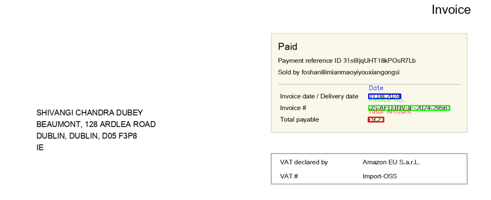
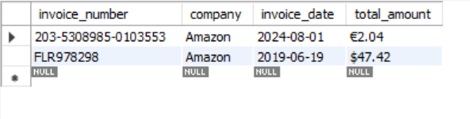

# Optical-Character-Recognition-for-Invoice-Images

# Invoice OCR System

## Project Overview
This project is an **Optical Character Recognition (OCR) system for invoice processing**. It extracts key invoice details such as **invoice number, date, and total amount** from images and stores them in a **MySQL database**. The system supports invoices from multiple companies (Amazon, Flipkart, Myntra) and prevents duplicate entries by using the invoice number as the primary key.

## Features
- **Invoice Image Preprocessing**: Converts images to grayscale, applies Gaussian blur, and uses thresholding for better OCR results.
- **OCR Extraction**: Uses Tesseract OCR to extract invoice number, date, and total amount.
- **Pattern Matching**: Uses regular expressions to correctly identify invoice components.
- **Database Integration**: Stores extracted data in a MySQL database with duplicate entry prevention.
- **Visual Output**: Displays bounding boxes around detected invoice details for verification.

## Project Structure
```
Invoice-OCR/
│── ocr_invoice.py           # Main OCR processing script
│── database.py              # Database connection and storage logic
│── requirements.txt         # Required Python packages
│── README.md                # Project documentation
│── images/
│   │── amazon_ie_boxes.png  # Processed invoice sample (Ireland)
│   │── amazon_us_boxes.png  # Processed invoice sample (US)
│   │── invoices_db.png      # Screenshot of MySQL database
```

## Installation
### Prerequisites
Ensure you have the following installed:
- Python (>=3.7)
- MySQL Server & MySQL Workbench
- Tesseract OCR (installed and added to the system path)
- Required Python libraries

### Install Dependencies
```sh
pip install -r requirements.txt
```

## Usage
### 1. Run the OCR System
```sh
python ocr_invoice.py
```
- The script will prompt you to enter the company name (**Amazon, Flipkart, or Myntra**).
- It will process the invoice image, extract relevant details, and store them in the database.
- The extracted data will be displayed on the terminal and saved in the MySQL database.

### 2. Viewing Extracted Data
To view the stored data, open **MySQL Workbench** and run:
```sql
SELECT * FROM invoices;
```

## Database Schema
The extracted invoice details are stored in a MySQL table named `invoices`:
```sql
CREATE TABLE invoices (
    id INT AUTO_INCREMENT PRIMARY KEY,
    company VARCHAR(255),
    invoice_number VARCHAR(255) UNIQUE,
    invoice_date DATE,
    total_amount VARCHAR(50)
);
```

## Screenshots
### OCR Processed Invoice Samples
#### Amazon Invoice (Ireland)


#### Amazon Invoice (US)


### MySQL Database


## Future Enhancements
- Improve total amount extraction to handle multiple currency formats more accurately.
- Add support for additional invoice templates.
- Implement a web-based UI for easy invoice uploading and data visualization.

## License
This project is licensed under the MIT License.

## Contact
For any issues or contributions, feel free to reach out or create a pull request on GitHub.
